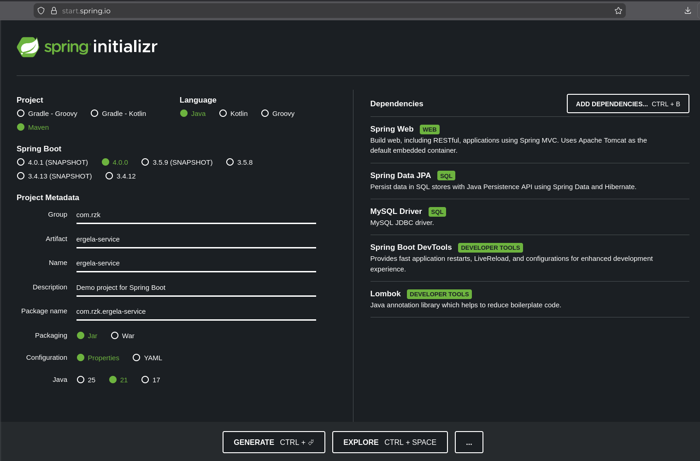

RZK Vežbe 3 - TUTORIJAL
---
Za razliku od vežbi 1 i 2 (jedan projekat `ergela-services`), ovde gradimo **tri odvojena projekta** koji se dižu kao **tri odvojene aplikacije** i međusobno komuniciraju preko mreže. Ovaj fajl pokriva samo **scaffolding** — kreiranje sva tri projekta, zavisnosti i portove. Kod svakog servisa ide u zasebne tutorijale.

### Arhitektura — šta pravimo

```
        ┌────────────────────-┐
        │   config-server     │  :8888
        │  @EnableConfigServer│
        │  servira parametre  │
        │  iz lokalnog git-a  │
        └─────────┬──────────-┘
                  │ (na startu vuče datasource parametre)
                  ▼
        ┌────────────────────┐          ┌────────────────────────────┐
        │ horse-management-  │  :8080   │ analytics-processing-      │  :8081
        │ service            │◄───────--│ service                    │
        │ (priča sa bazom)   │RestClient   (nema bazu, samo obrađuje)│
        │ /horses            │          │ /analytics/horses/...      │
        └─────────┬──────────┘          └────────────────────────────┘
                  │ JPA
                  ▼
             MySQL [rzk-baza]
```

Tri komada:
- **config-server** — nema bazu, nema web endpoint-e; jedini posao mu je da iz lokalnog git repozitorijuma servira `.properties` fajlove drugim servisima.
- **horse-management-service** — jedini koji priča sa bazom; datasource parametre ne drži kod sebe, nego ih na startu povuče sa config servera.
- **analytics-processing-service** — nema bazu; preko `RestClient`-a zove horse-management i obrađuje ono što dobije.

#### Portovi (zaključati ih, da se pozivi poklope)

| servis                       | port   | baza             | uloga u config-u             |
| ---------------------------- | ------ | ---------------- | ---------------------------- |
| config-server                | `8888` | ne               | **servira** parametre        |
| horse-management-service     | `8080` | da (MySQL `rzk`) | **klijent** (vuče parametre) |
| analytics-processing-service | `8081` | ne               | ne koristi config server     |


Mikroservisi + Spring Cloud Config
---

**Spring Cloud** = kutija alata za mikroservise. Kad app nije jedan veliki monolit nego gomila malih servisa, treba ti: gde su parametri, kako se nalaze, kako pričaju. Spring Cloud to rešava. Nama treba samo jedan deo: **Config** (centralno čuvanje podešavanja).

**Poenta celih vežbi:** umesto jedan program → **razbij na male servise** koji rade svako svoje i pričaju preko mreže (HTTP). To je mikroservisna arhitektura. Vežbe pokazuju 3 stuba te priče: centralni config, servis-sa-bazom, servis-koji-zove-drugi-servis.

**Tri projekta:**

- **config-server** = ostava za podešavanja. Ne radi ništa korisno sam. Drži datasource parametre (url/user/pass) na jednom mestu i deli ih. Zašto? Da 10 servisa ne kopira istu lozinku 10 puta — promeniš na jednom mestu, svi vide.
- **horse-management-service** = jedini što dira bazu. Vadi konje. Ali svoje parametre za bazu **ne drži kod sebe** — pita config-server „daj mi datasource". Endpoint-i `/horses`, `/horses/{id}`.
- **analytics-processing-service** = nema bazu, lenj. Ne zna ništa o MySQL-u. Kad treba konje → **zove horse-management preko mreže** (RestClient), dobije JSON, obradi (prebroji, izvuče ime). Endpoint-i `/analytics/horses/...`.

☝️🤓 Zašto dva servisa a ne jedan? Poenta demonstracije: **servis zove servis**. U pravom svetu analytics može da bude drugi tim, drugi jezik, druga mašina — samo mu treba HTTP adresa horse-managementa.

**Šta će nam git:**

config-server ne izmišlja parametre — **čita ih iz git repozitorijuma**. Ti napraviš folder, u njega `horse-management.properties` (url/user/pass), `git init` + commit. Config-server gleda taj git repo i servira šta nađe.

Zašto git a ne običan folder? Jer git = **istorija**. Promeniš lozinku → commit → imaš zapis ko/kad/šta. Možeš da se vratiš na staru verziju. Config kroz git = „podešavanja tretiramo kao kod" (versionisana, praćena). Za vežbe je lokalni git dovoljan (nema GitHub), samo `file://` putanja do foldera na tvom disku.

Ukratko lanac: **ti pišeš .properties → git → config-server čita git → horse-management pita config-server → horse-management priča sa bazom → analytics pita horse-management.** 

# Setup projekta
---
### Korak 1 — Kreiranje tri projekta na start.spring.io

Za **svaki** projekat ideš na https://start.spring.io/, generišeš ZIP, raspakuješ. Ista podešavanja za sve (Maven, Java **21**, Spring Boot **4.0.0**, Group `com.rzk`), samo se menjaju **Artifact** i **Dependencies**.



**Projekat 1 — config-server**

|              |                                         |
| ------------ | --------------------------------------- |
| Group        | com.rzk                                 |
| Artifact     | config-server                           |
| Dependencies | **Config Server**, Spring Boot DevTools |

**Projekat 2 — horse-management-service**

|              |                                                                                                            |
| ------------ | ---------------------------------------------------------------------------------------------------------- |
| Group        | com.rzk                                                                                                    |
| Artifact     | horse-management-service                                                                                   |
| Dependencies | **Spring Web**, **Spring Data JPA**, **MySQL Driver**, **Config Client**, **Lombok**, Spring Boot DevTools |

**Projekat 3 — analytics-processing-service**

|              |                                                  |
| ------------ | ------------------------------------------------ |
| Group        | com.rzk                                          |
| Artifact     | analytics-processing-service                     |
| Dependencies | **Spring Web**, **Lombok**, Spring Boot DevTools |

### Korak 2 — Otvaranje u IntelliJ-u

Sva tri projekta možeš da držiš otvorena istovremeno (svaki u svom prozoru), jer se i pokreću istovremeno.

Za svaki:
1. **File → Open** → izaberi raspakovan folder → **Open as Project**.
2. Sačekaj da Maven povuče zavisnosti (progress bar dole).
3. Ako posle otvaranja fali nešto od zavisnosti: **Maven → Sync Project** (i po potrebi **Generate Sources and Update Folders**).

### Redosled pokretanja (bitno!)

Servisi zavise jedan od drugog, pa se **ne dižu bilo kojim redom**:

1. **config-server** prvi (da parametri budu dostupni)
2. **horse-management-service** drugi (na startu vuče datasource sa servera)
3. **analytics-processing-service** poslednji (zove horse-management)


Šta dalje
---

Sledeća tri koraka tutorijala :

1. **config-server** — `@EnableConfigServer`, `application.properties`, pravljenje **lokalnog git repo-a** koji server servira, i provera da server vraća parametre.
2. **horse-management-service** — Config Client, modeli `Horse`/`Breed`, repo/service/controller, endpoint-i `/horses` i `/horses/{idHorse}`.
3. **analytics-processing-service** — `RestClient`, `HorseDto`, endpoint-i `/analytics/horses`, `/analytics/horses/count`, `/analytics/horses/name/{idHorse}`.

---
# Korak 1 - config-server
---
Centralno serviranje konfiguracije iz git repozitorijuma

---

_config-server dobavlja parametre za konekciju na bazu iz lokalnog git repozitorijuma i servira ih drugim servisima._

config-server sam po sebi **ne radi ništa korisno** — nema endpoint-e, nema bazu. Njegov jedini posao: pročita `.properties` fajlove iz jednog git repozitorijuma i ponudi ih drugim servisima preko HTTP-a. U našem slučaju servira datasource parametre servisu `horse-management`.

---

### Korak 1.1 — Glavna klasa (`@EnableConfigServer`)

Spring Initializr je već napravio `ConfigServerApplication.java`. 
Dodaj mu jednu anotaciju — `@EnableConfigServer`:

java

```java
package com.rzk.config_server;

import org.springframework.boot.SpringApplication;
import org.springframework.boot.autoconfigure.SpringBootApplication;
import org.springframework.cloud.config.server.EnableConfigServer;

@EnableConfigServer
@SpringBootApplication
public class ConfigServerApplication {

    public static void main(String[] args) {
        SpringApplication.run(ConfigServerApplication.class, args);
    }

}
```

Šta rade anotacije:

- `@SpringBootApplication` — standardno, pokreće Spring Boot aplikaciju
- `@EnableConfigServer` — uključuje config-server mašineriju; bez nje projekat je običan Boot bez ikakve config-server logike. Dolazi iz zavisnosti **Config Server** (`spring-cloud-config-server`) koju si čekirao pri kreiranju.

#### Napomene:

- `@EnableConfigServer` ide **iznad** glavne klase (uz `@SpringBootApplication`).
- Ovo je jedina Java klasa koju config-server ima. Nema kontrolera, servisa ni repozitorijuma — sve radi Spring Cloud ispod.

---

### Korak 1.2 — `application.properties`

Otvori `src/main/resources/application.properties`:


```properties
spring.application.name=config-server
server.port=8888

# !!! PROMENITI PUTANJU !!!
spring.cloud.config.server.git.uri=file://D:/apsolutna/putanja/config-repo
spring.cloud.config.server.git.default-label=main
```

#### Šta ovo znači:

- `spring.application.name=config-server` — ime ove aplikacije
- `server.port=8888` — config-server sluša na portu **8888** (dogovoreni port za config servere)
- `spring.cloud.config.server.git.uri=...` — **putanja do git repozitorijuma** iz kojeg server čita konfiguraciju. `file://` znači lokalni folder na tvom disku (ne GitHub). **Ovu putanju obavezno promeni** na svoju (folder pravimo u Koraku 3).
- `spring.cloud.config.server.git.default-label=main` — koju **granu** git repo-a da čita. Ovde je `master`.


☝️🤓 Kako dobiti putanju?
Linux / MacOS 
1. U terminalu navigirajte do vašeg foldera
2. Ukucajte komandu:
	`realpath`
3. Output komande kopirajte u applications.properties (da. treba da ima 3 kose crte)


---

### Korak 1.3 — Lokalni git repo

Config-server čita parametre iz git repo-a. Taj repo praviš **ti**, ručno.

**1. Napravi folder** `config-repo` (u folderu sa 3 projekta koje ste napravili u Koraku 1; ta putanja ide u `git.uri` iz Koraka 2).

**2. U njemu napravi fajl `horse-management-service.properties`** sa sadržajem:

```properties
spring.datasource.url=jdbc:mysql://nastava.is.pmf.uns.ac.rs:3306/rzk
spring.datasource.username=rzk
spring.datasource.password=rzkStudent2019!
spring.jpa.hibernate.naming.physical-strategy=org.hibernate.boot.model.naming.PhysicalNamingStrategyStandardImpl

spring.datasource.hikari.maximum-pool-size=2
```

**3. Inicijalizuj git i komituj** 
U Terminalu, unutar `config-repo` foldera:
```
git init -b main
git add .
git commit -m "config za horse-management"
```

#### Napomene:

- **Ime fajla je ključno.** Mora biti `horse-management.properties` jer se poklapa sa `spring.application.name` klijent-servisa (`horse-management`). Po imenu fajla config-server zna kome servira parametre. `horse-management-service.properties` ili `horse.properties` **ne bi radilo**.
- `config-repo` je **odvojen folder**, nije unutar nijednog Spring projekta. Nema `pom.xml`, nema `src/` — samo `.properties` fajl(ovi) + skriveni `.git`.
- Ako si već uradio `git init` (bez `-b main`) i dobio granu `master`, preimenuj je: `git branch -m main`. (U verziji Git 3.0, tba late 2026 release, main će postati default naziv grana)
- Svaka izmena konfiguracije mora da se **commituje** — server čita iz commit-ovane verzije, ne iz neujsačuvanog fajla.

☝️🤓 Zašto git a ne običan folder? Config kroz git = podešavanja se tretiraju kao kod: imaš istoriju (ko/kad/šta promenio), možeš da se vratiš na prethodnu verziju. Za vežbe je dovoljan lokalni git (bez GitHub-a), preko `file://` putanje.

---

### Korak 1.4 — Pokretanje i provera

Pokreni `ConfigServerApplication` (zeleno **Run** dugme). U konzoli treba da vidiš da se Tomcat digao na portu **8888**.

Proveri da server servira konfiguraciju — u browser-u ili Talend API:

```
GET http://localhost:8888/horse-management/default
```

Očekivano: **status 200** + JSON u kome su tvoji parametri iz `horse-management.properties`:

json

```json
{
    "name": "horse-management",
    "profiles": ["default"],
    "label": null,
    "version": "…hash poslednjeg commit-a…",
    "propertySources": [
        {
            "name": "file://…/config-repo/horse-management.properties",
            "source": {
                "spring.datasource.url": "jdbc:mysql://nastava.is.pmf.uns.ac.rs:3306/rzk",
                "spring.datasource.username": "rzk",
                "spring.datasource.password": "rzkStudent2019!",
                "spring.jpa.hibernate.naming.physical-strategy": "org.hibernate.boot.model.naming.PhysicalNamingStrategyStandardImpl",
                "spring.datasource.hikari.maximum-pool-size": "2"
            }
        }
    ]
}
```

#### Šta znači URL `/horse-management/default`:

- `horse-management` — **ime aplikacije** (mora da se poklopi sa imenom `.properties` fajla)
- `default` — **profil** (nemamo posebne profile tipa `dev`/`prod`, pa `default`)

#### Napomene:

- Ako je `propertySources` **prazan** ili dobiješ prazan `source`: najčešće je kriva **grana** (repo na `main`, a server traži `master`) ili **ime fajla** (nije `horse-management`).
- Ako server ne može da nađe repo: proveri `git.uri` putanju (tačan `file://` prefiks, tačna apsolutna putanja).
- Zadnji commit se vidi kroz `version` (hash) — ako si menjao fajl a nisi commitovao, server i dalje servira staru verziju.

---

### Šta se desilo pod haubom

1. Na startu config-server pročita `git.uri` i „checkout"-uje granu `master` iz lokalnog `config-repo`.
2. Stigne zahtev `GET /horse-management/default`.
3. Server u repo-u traži fajl čije ime odgovara aplikaciji → `horse-management.properties`.
4. Pročita njegov sadržaj i vrati ga kao JSON (`propertySources`).
5. Kasnije, kad se digne `horse-management-service`, on **na svom startu** pogodi baš ovaj endpoint, povuče ove parametre i ubaci ih u svoj `Environment` — pa se poveže na bazu iako te parametre nema kod sebe.

---
# Korak 2 - horse-management-service
---
Servis koji priča sa bazom (parametre vuče sa config servera)

---

_horse-management-service komunicira sa bazom (parametre dobavlja od config servera) i ima endpoint-ove `/horses` i `/horses/{idHorse}`._

Ovo je jedini servis koji dira bazu. Trik: datasource parametre (url/user/pass) **ne drži kod sebe** — povuče ih sa config-servera na startu. Sve ostalo (model, repo, service, controller) je isto kao u vežbama 1–2.

> **Pre pokretanja:** config-server (port 8888) mora da radi. horse-management na startu ide po parametre kod njega.

> **Uključi VPN**: za ovaj korak nam je potrebna PMF rzk baza, pa se moramo povezati na VPN.

---

### Korak 2.1 — `application.properties`

Otvori `src/main/resources/application.properties`:

```properties
spring.application.name=horse-management-service
server.port=8080
spring.config.import=optional:configserver:http://localhost:8888
```

#### Šta ovo znači:

- `spring.application.name=horse-management` — ime servisa. **Ovo je isto ime** koje config-server koristi da nađe `horse-management.properties` u git repo-u. Da se ne poklapa → server ne bi vratio parametre.
- `server.port=8080` — servis sluša na **8080** (baš port koji analytics kasnije zove preko RestClient-a).
- `spring.config.import=optional:configserver:http://localhost:8888` — reci Spring-u: „na startu idi na config-server (8888) i uvezi konfiguraciju za mene".

☝️🤓 Primeti šta **NIJE** ovde: nema `spring.datasource.url/username/password`. Te parametre servis dobija sa config-servera (fajl `horse-management.properties` iz git repo-a). U tome je cela poenta config-servera — kredencijali baze su na jednom mestu, ne kopiraju se po servisima.

☝️🤓 Prefiks `optional:` znači: ako config-server **nije** dostupan, servis se **svejedno digne** (bez tih parametara), umesto da pukne na startu. Bez `optional:`, ako server ne radi, horse-management ne bi ni startovao. Zato je uredan redosled: prvo config-server, pa ovaj.

☝️🤓 Za razliku od config-servera (kome je trebala anotacija `@EnableConfigServer`), **klijentu ne treba nikakva anotacija**. Dovoljni su zavisnost **Config Client** (`spring-cloud-starter-config`) + linija `spring.config.import`. Glavna klasa `HorseManagementServiceApplication` ostaje čista, sa samo `@SpringBootApplication`.

---

### Korak 2.2 — Modeli `Horse` i `Breed`

Entiteti su isti kao u ergeli iz vežbi 1 (baza je ista `rzk`). Trebaju nam dva: `Horse` i `Breed` (jer `Horse` ima vezu ka rasi).

`model/Horse.java`:

```java
package com.rzk.horse_management_service.model;

import jakarta.persistence.*;
import lombok.Getter;
import lombok.Setter;

import java.time.LocalDate;

@Getter
@Setter
@Entity
public class Horse {
    @Id
    @GeneratedValue(strategy = GenerationType.IDENTITY)
    @Column(name = "id", nullable = false)
    private Integer id;

    @Column(name = "fullName", nullable = false, length = 45)
    private String fullName;

    @Column(name = "nickname", length = 45)
    private String nickname;

    @Column(name = "gender", nullable = false, length = 1)
    private String gender;

    @Column(name = "dateOfBirth", nullable = false)
    private LocalDate dateOfBirth;

    @ManyToOne(optional = false)
    @JoinColumn(name = "breed", nullable = false)
    private Breed breed;

}
```

`model/Breed.java`:

```java
package com.rzk.horse_management_service.model;

import jakarta.persistence.*;
import lombok.Getter;
import lombok.Setter;

@Getter
@Setter
@Entity
public class Breed {
    @Id
    @GeneratedValue(strategy = GenerationType.IDENTITY)
    @Column(name = "id", nullable = false)
    private Integer id;

    @Column(name = "name", nullable = false, length = 45)
    private String name;

    @Column(name = "coatColor", nullable = false, length = 45)
    private String coatColor;

}
```

Šta rade anotacije:

- `@Entity` — klasa se mapira na tabelu; pošto **nema** `@Table`, ime tabele se izvodi iz imena klase (`horse`, `breed`)
- `@Getter @Setter` (Lombok) — svi geteri/seteri automatski
- `@Id` + `@GeneratedValue(IDENTITY)` — primarni ključ, auto-increment
- `@Column(name=..., nullable=..., length=...)` — mapiranje na tačnu kolonu
- `@ManyToOne(optional = false)` — više konja pripada jednoj rasi; `optional=false` → konj **mora** imati rasu
- `@JoinColumn(name = "breed", nullable = false)` — u tabeli `horse` kolona `breed` je strani ključ ka `breed.id`

#### Napomene:

- `nickname` je jedino polje bez `nullable=false` → nadimak sme da bude `null`.
- Nema obrnute `@OneToMany` strane (ne treba nam ovde) — samo `Horse → Breed`.

---

### Korak 2.3 — `HorseRepository`

`repository/HorseRepository.java`:

```java
package com.rzk.horse_management_service.repository;

import com.rzk.horse_management_service.model.Horse;
import org.springframework.data.jpa.repository.JpaRepository;

public interface HorseRepository extends JpaRepository<Horse, Integer> {
}
```


---

### Korak 2.4 — `HorseService`

`service/HorseService.java`:

```java
package com.rzk.horse_management_service.service;

import com.rzk.horse_management_service.model.Horse;
import com.rzk.horse_management_service.repository.HorseRepository;
import lombok.RequiredArgsConstructor;
import org.springframework.stereotype.Service;

import java.util.List;

@Service
@RequiredArgsConstructor
public class HorseService {

    private final HorseRepository horseRepository;

    public List<Horse> getAllHorses() {
        return horseRepository.findAll();
    }

    public Horse getHorseById(Integer id) {
        return horseRepository.findById(id).get();
    }
}
```

Šta rade anotacije:

- `@Service` — Spring registruje bean
- `@RequiredArgsConstructor` (Lombok) — konstruktor za `final` polja → injektuje `HorseRepository` (bez `@Autowired`)

#### Napomene:

- `getAllHorses()` — samo prosledi `findAll()`.
- `getHorseById(id)` — `findById(id)` vrati `Optional<Horse>`, pa `.get()` izvuče vrednost.

☝️🤓 `.get()` na `Optional`-u je **bez provere**. Ako konj sa tim id-jem **ne postoji**, `findById` vrati prazan `Optional`, a `.get()` baci `NoSuchElementException` → klijent dobije **500**. U vežbama 2 smo ovakve slučajeve hvatali izuzecima i vraćali 404 — ovde toga nema (namerno, jednostavnija verzija). Dobro je znati da nepostojeći id ovde daje 500, ne 404.

---

### Korak 2.5 — `HorseController`

`controller/HorseController.java`:

```java
package com.rzk.horse_management_service.controller;

import com.rzk.horse_management_service.model.Horse;
import com.rzk.horse_management_service.service.HorseService;
import lombok.RequiredArgsConstructor;
import org.springframework.web.bind.annotation.GetMapping;
import org.springframework.web.bind.annotation.PathVariable;
import org.springframework.web.bind.annotation.RequestMapping;
import org.springframework.web.bind.annotation.RestController;

import java.util.List;

@RestController
@RequiredArgsConstructor
@RequestMapping("/horses")
public class HorseController {

    private final HorseService horseService;

    @GetMapping
    public List<Horse> getAllHorses() {
        return horseService.getAllHorses();
    }

    @GetMapping("/{idHorse}")
    public Horse getHorseById(@PathVariable Integer idHorse) {
        return horseService.getHorseById(idHorse);
    }
}
```

#### Napomene:

- Nema `@RequestMapping("/api")` prefiksa kao u vežbama 1 — ovde je bazna putanja samo `/horses`.
- Kontroler nema logiku — samo poziva servis.

---

### Korak 2.6 — Pokretanje i testiranje

Redosled: **config-server (8888)** već radi → pokreni `HorseManagementServiceApplication`. U konzoli: Tomcat na portu **8080**.

**Endpoint 1 — svi konji**

```
GET http://localhost:8080/horses
```

Očekivano: **200** + JSON niz konja (svaki sa ugneždenim `breed` objektom):

```json
[
    {
        "id": 1,
        "fullName": "Thunderbolt",
        "nickname": "Thunder",
        "gender": "M",
        "dateOfBirth": "2019-04-12",
        "breed": {
            "id": 1,
            "name": "Arabian",
            "coatColor": "bay"
        }
    }
]
```

**Endpoint 2 — konj po id-ju**

```
GET http://localhost:8080/horses/1
```

Očekivano: **200** + jedan konj (isti oblik kao gore, jedan objekat).

#### Napomene:

- Ako pozoveš nepostojeći id (npr. `/horses/9999`) → **500** (zbog `.get()` iz Koraka 4), ne 404.
- Ako dobiješ grešku oko konekcije na bazu: proveri da config-server radi i da `GET http://localhost:8888/horse-management/default` vraća parametre (bez njih horse-management nema datasource).

---

### Šta se desilo pod haubom

1. Na startu horse-management vidi `spring.config.import=configserver:http://localhost:8888` → ode na config-server i povuče `horse-management.properties` (datasource url/user/pass + naming strategy + hikari pool).
2. Ti parametri uđu u `Environment`; Hibernate se pomoću njih konektuje na MySQL `rzk`.
3. Stigne `GET /horses` → `HorseController.getAllHorses()` → `HorseService.getAllHorses()` → `HorseRepository.findAll()` → `SELECT * FROM horse` (+ dohvat rase za svakog).
4. Rezultat `List<Horse>` se serijalizuje u JSON (sa ugneždenim `breed`) i vrati klijentu.
5. Za `/horses/{idHorse}` isti tok, samo `findById(id).get()` → jedan `Horse`.

---


# Korak 3— analytics-processing-service
---
Servis bez baze — zove horse-management preko RestClient-a

---

_analytics-processing-service nema pristup bazi, već pomoću RestClient-a poziva endpoint-ove od horse-management servisa i obrađuje dobijene informacije._

Ovaj servis **ne zna ništa o bazi** — nema JPA, nema MySQL, nema config-client. Njemu treba samo Spring Web (za RestClient i svoje endpoint-e). Kad mu zatrebaju konji, on ih **preko HTTP-a traži od horse-managementa** (`localhost:8080`) i onda obrađuje odgovor.

> **Pre pokretanja:** horse-management-service (port 8080) mora da radi — analytics zove njega. (Takođe, config-server + VPN moraju raditi)

---

### ⚠️ Bitno: endpoint-i se razlikuju od prezentacije

Prezentacija kaže `/analytics/count` i `/analytics/name/{idHorse}`, ali u kodu klasa ima `@RequestMapping("/analytics/horses")`, pa sve putanje idu **ispod** toga. Tutorijal prati **kod**:

| prezentacija                | stvаrna putanja (iz koda)          |
| --------------------------- | ---------------------------------- |
| `/analytics/horses`         | `/analytics/horses` ✅              |
| `/analytics/count`          | `/analytics/horses/count`          |
| `/analytics/name/{idHorse}` | `/analytics/horses/name/{idHorse}` |

---

### Korak 3.1 — `application.properties`

```properties
spring.application.name=analytics-processing-service
server.port=8081
```


---

### Korak 3.2 — `HorseDto` (DTO klasa za konja)

Analytics ne koristi entitet `Horse` (nema ni bazu ni taj model). Umesto toga pravi **svoju** klasu u koju „upakuje" polja koja ga zanimaju iz odgovora horse-managementa.

`dto/HorseDto.java`:

```java
package com.rzk.analytics_processing_service.dto;

import lombok.Getter;

import java.time.LocalDate;

@Getter
public class HorseDto {

    private String fullName;
    private String nickname;
    private String gender;
    private LocalDate dateOfBirth;
}
```

#### Napomene:

- Polja se **imenom** poklapaju sa JSON-om koji vraća horse-management (`fullName`, `nickname`, ...). Po imenu Jackson mapira JSON → DTO.
- DTO namerno **nema `id` ni `breed`** — analytics ih ne treba. Kad se JSON konja deserijalizuje u `HorseDto`, ta polja se jednostavno ignorišu.
- Za endpoint `/name` trebaju samo `fullName` + `nickname`, ali DTO nosi i `gender`/`dateOfBirth` (ne smeta).

---

### Korak 3.3 — `AnalyticsService` (RestClient)

`service/AnalyticsService.java`:

```java
package com.rzk.analytics_processing_service.service;

import com.rzk.analytics_processing_service.dto.HorseDto;
import org.springframework.core.ParameterizedTypeReference;
import org.springframework.stereotype.Service;
import org.springframework.web.client.RestClient;

import java.util.List;

@Service
public class AnalyticsService {

    private final RestClient restClient = RestClient.create("http://localhost:8080");

    public List<HorseDto> fetchAllHorses() {
        return restClient.get()
                .uri("/horses")
                .retrieve()
                .body(ParameterizedTypeReference.forType(List.class));
    }

    public HorseDto fetchHorseById(Integer idHorse) {
        return restClient.get()
                .uri("/horses/{id}", idHorse)
                .retrieve()
                .body(HorseDto.class);
    }
}
```

Šta rade anotacije / delovi:

- `@Service` — Spring bean
- `RestClient.create("http://localhost:8080")` — pravi HTTP klijent sa **baznim URL-om** = adresa horse-managementa. Svi pozivi kreću odatle.
- `.get().uri("/horses").retrieve().body(...)` — uradi `GET http://localhost:8080/horses`, uzmi telo odgovora i deserijalizuj ga
- `.uri("/horses/{id}", idHorse)` — `{id}` se zameni vrednošću `idHorse` → `GET .../horses/5`
- `.body(HorseDto.class)` — deserijalizuj odgovor u `HorseDto`

#### Napomene:

- `restClient` se pravi **inline** (`= RestClient.create(...)`), nije poseban `@Bean`. Radi, jednostavnije za vežbu.
- Bazni URL `http://localhost:8080` je **zakucan** → horse-management **mora** biti na 8080. Ako promeniš njegov port, promeni i ovde.

☝️🤓 Razlika u dve metode:

`fetchHorseById` koristi `.body(HorseDto.class)` → odgovor se  mapira u `HorseDto` (višak polja `id`/`breed` se ignoriše). `

`fetchAllHorses` koristi `.body(ParameterizedTypeReference.forType(List.class))` → to je sirova `List` bez tipa elementa, pa Jackson napravi `List` mapa (svaki konj = mapa sa svim poljima koje je horse-management poslao). 

Praktična posledica: `/analytics/horses` vrati konje kao klasu (sa `id` i `breed`), ne skraćene na DTO polja. Za brojanje (`/count`) to je svejedno.

---

### Korak 3.4 — `AnalyticsController`

`controller/AnalyticsController.java`:

```java
package com.rzk.analytics_processing_service.controller;

import com.rzk.analytics_processing_service.dto.HorseDto;
import com.rzk.analytics_processing_service.service.AnalyticsService;
import lombok.AllArgsConstructor;
import org.springframework.web.bind.annotation.GetMapping;
import org.springframework.web.bind.annotation.PathVariable;
import org.springframework.web.bind.annotation.RequestMapping;
import org.springframework.web.bind.annotation.RestController;

import java.util.List;

@RestController
@RequestMapping("/analytics/horses")
@AllArgsConstructor
public class AnalyticsController {

    private final AnalyticsService analyticsService;

    @GetMapping
    public List<HorseDto> getAllHorses() {
        return analyticsService.fetchAllHorses();
    }

    @GetMapping("/count")
    public String countHorses() {
        List<HorseDto> horses = analyticsService.fetchAllHorses();
        return "There are " + horses.size() + " horses in the database.";
    }

    @GetMapping("/name/{idHorse}")
    public String getHorseNameById(@PathVariable Integer idHorse) {
        HorseDto horseDto = analyticsService.fetchHorseById(idHorse);
        return "Horse with id: " + idHorse + " is named " + horseDto.getFullName() + " (" + horseDto.getNickname() + ").";
    }
}
```

Šta rade anotacije:

- `@RestController` — povratna vrednost je telo odgovora (JSON ili čist tekst)
- `@RequestMapping("/analytics/horses")` — **bazna putanja za sve** metode u klasi (odatle i pomeranje `/count` i `/name` pod `/analytics/horses/...`)
- `@AllArgsConstructor` (Lombok) — konstruktor sa svim poljima → injektuje `AnalyticsService`
- `@GetMapping` (prazno) → `GET /analytics/horses`
- `@GetMapping("/count")` → `GET /analytics/horses/count`
- `@GetMapping("/name/{idHorse}")` + `@PathVariable Integer idHorse` → `GET /analytics/horses/name/{idHorse}`

#### Napomene:

- `countHorses()` povuče sve konje pa vrati `.size()` upakovan u  **običan `String`**, ne JSON.
- `getHorseNameById()` — `id` u poruci dolazi iz **path varijable** (`idHorse`), a ne iz DTO-a (DTO nema `id`). `fullName` i `nickname` dolaze iz DTO-a.
- Ovde je `@AllArgsConstructor` (u horse-managementu je bio `@RequiredArgsConstructor`) — oba rade jer ima jedno `final` polje.

---

### Korak 3.5 — Pokretanje i testiranje

Redosled: config-server (8888) + VPN → horse-management (8080) → sad pokreni `AnalyticsProcessingServiceApplication` (port **8081**).

**Endpoint 1 — svi konji**

```
GET http://localhost:8081/analytics/horses
```

Očekivano: **200** + JSON niz konja (puni objekti, prosleđeni iz horse-managementa).

**Endpoint 2 — broj konja**

```
GET http://localhost:8081/analytics/horses/count
```

Očekivano: **200** + tekst:

```
There are 5 horses in the database.
```

**Endpoint 3 — ime + nadimak konja**

```
GET http://localhost:8081/analytics/horses/name/1
```

Očekivano: **200** + tekst:

```
Horse with id: 1 is named Thunderbolt (Thunder).
```

#### Napomene:

- Ako analytics vrati grešku, prvo proveri da **horse-management radi** (`GET http://localhost:8080/horses` mora da vraća konje). analytics je samo posrednik.
- Ako je nadimak konja `null` u bazi, u poruci `/name` će pisati `(null)`.

---

### Šta se desilo pod haubom (npr. `/analytics/horses/count`)

1. Stigne `GET http://localhost:8081/analytics/horses/count` na analytics.
2. `AnalyticsController.countHorses()` zove `AnalyticsService.fetchAllHorses()`.
3. `RestClient` pošalje `GET http://localhost:8080/horses` horse-managementu.
4. horse-management ode u bazu, vrati JSON niz konja; RestClient ga deserijalizuje u `List`.
5. Kontroler uzme `.size()` i sklopi rečenicu → vrati je kao tekst.

Za `/name/{idHorse}`: isto, samo `RestClient` zove `GET localhost:8080/horses/{id}`, odgovor se mapira u `HorseDto`, pa se iz njega izvuku `fullName` i `nickname`.

---


Cela slika — kako se tri servisa spajaju
---
```
config-repo (git, grana master/main)
   └── horse-management.properties  (datasource url/user/pass)
              ▲ čita
   config-server  :8888
              ▲ na startu vuče parametre
   horse-management-service  :8080  ──JPA──►  MySQL rzk  (treba VPN)
              ▲ RestClient (GET /horses, /horses/{id})
   analytics-processing-service  :8081
```

**Redosled pokretanja (uvek):**

1. **PMF VPN** (za bazu)
2. **config-server** (8888)
3. **horse-management-service** (8080)
4. **analytics-processing-service** (8081)

**Ceo lanac jednim pozivom** (`/analytics/horses/count`): analytics → horse-management → baza → nazad kroz horse-management → analytics obradi (prebroji) → odgovor. config-server je odigrao svoje još na startu horse-managementa (dao mu parametre baze).
